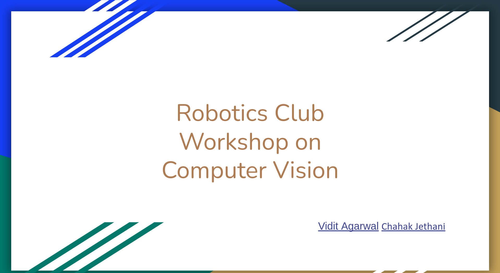

# ```Computer Vision```

# Slides
[Google Slides Link](https://docs.google.com/presentation/d/1loprApvn1Nq-XsvEs5N399PtzswPfcFYy_8hXChQHUY/edit?usp=sharing)

<p align='center'>
<a href="https://docs.google.com/presentation/d/1loprApvn1Nq-XsvEs5N399PtzswPfcFYy_8hXChQHUY/edit?usp=sharing"> </a>
</p>
  

# Recording of the Workshop
[YouTube Video Link](https://youtu.be/jVJCO6JxZHQ)

<p align='center'>
<a href="https://www.youtube.com/watch?v=jVJCO6JxZHQ"> </a>
</p>


# Resources    
- [Introduction to machine learning](https://www.youtube.com/playlist?list=PLoROMvodv4rMiGQp3WXShtMGgzqpfVfbU) - YouTube Playlist (Stanford)

- [Stanford’s CS231n (Computer Vision)](https://youtube.com/playlist?list=PLC1qU-LWwrF64f4QKQT-Vg5Wr4qEE1Zxk) (can directly jump to this if you are familiar with basics of ML)

- [Cheat Sheet for CNN](https://stanford.edu/~shervine/teaching/cs-230/cheatsheet-convolutional-neural-networks#)

- [Deep Learning with PyTorch](https://atcold.github.io/pytorch-Deep-Learning/) - NYU, Yann LeCun

- [CV by AWS ML University GitHub Repo](https://github.com/aws-samples/aws-machine-learning-university-accelerated-cv)

- [Deep Learning Specialization Coursera](https://www.coursera.org/learn/convolutional-neural-networks?specialization=deep-learning)

> [Link to Google Colaboratry Notebook executed in Workshop](https://colab.research.google.com/drive/1J2zLRp3fWnBu2vsixnMjATdtaOOpsjmZ?usp=sharing)
