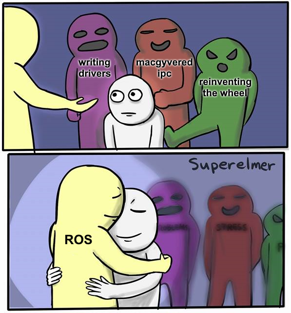

# ```Robotics Operating System```

<p align='center'>

</p>
<br>

### [Basics of ROS](https://github.com/Robotics-Club-IIT-BHU/ROS-Specialization-22/tree/main/week1)

<br>

```
It will be a lot easier to follow the upcoming workshop on ROS if u go through the above content the week 1 of the ROS Summer Camp. Going through this will give u a thorough understanding of the basics of ROS.
```
